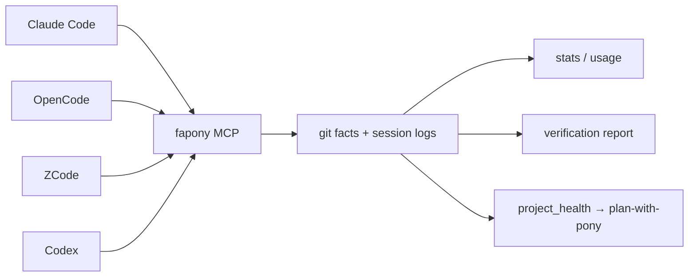
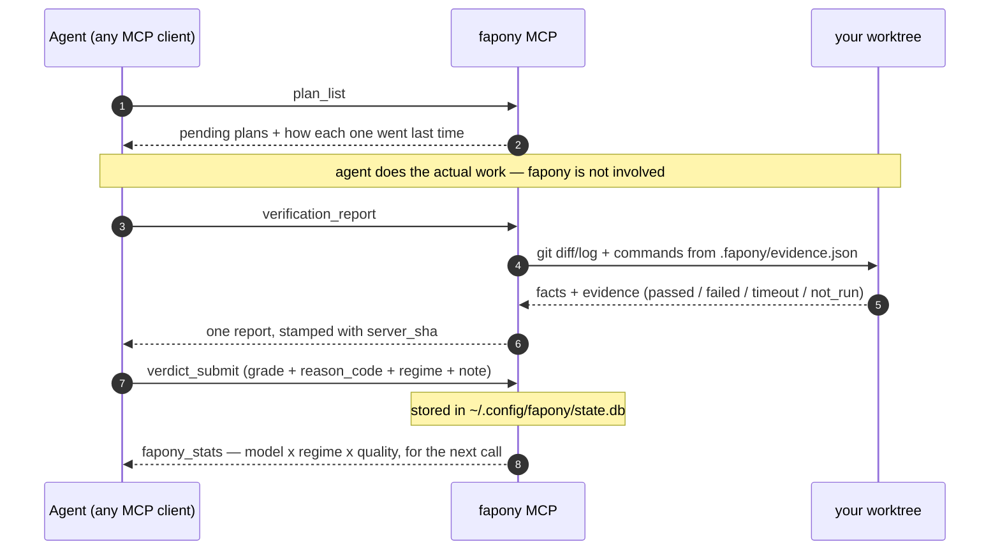
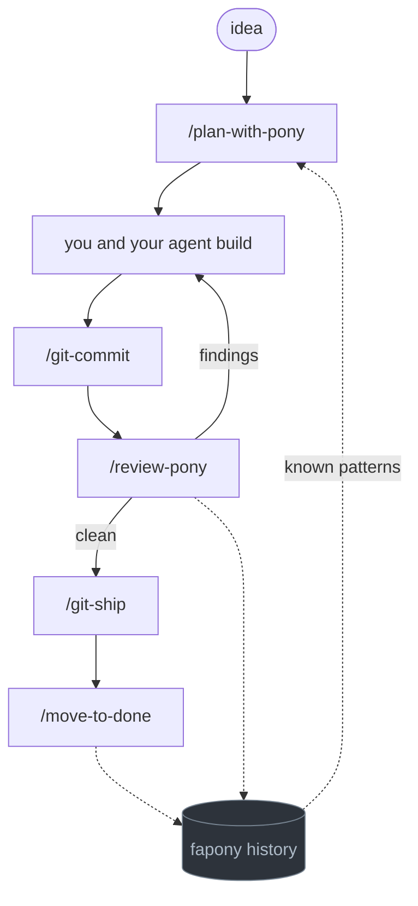

<p align="center">
  
</p>

# fapony

**Where did your tokens go?** fapony reads the session logs Claude Code, Codex, OpenCode and ZCode
already write, and puts them all on one yardstick — tokens, cost and time per model, per client,
per workflow. Nothing to instrument, no per-project setup, no waiting for data to accumulate: it
runs on the history already sitting on your disk.

<p align="center">
  
</p>

```bash
fapony usage-web        # every session you already have, all clients, one page
```

<details>
<summary>full usage-web dashboard preview</summary>

<p align="center">
  
</p>

</details>

That is day one. Past that, fapony measures what coding agents actually do — rounds, pass/fail,
cost per grade — through 8 MCP tools any agent can call. If you juggle more than one agent, this is
the point: the numbers come from the same yardstick everywhere, so "which model earns its keep on
which kind of task" becomes a data question instead of a vibe. On top of measurement it checks
claims against git facts: handoff conformance, allowlisted evidence, a 6-grade verdict — with
everything the agent claimed but couldn't prove marked as such.

**The reason to keep it running is the third layer: knowledge accumulation.** Any single client already logs its own session — timing, tokens, tool calls. What none of them see is *across* runs, clients and task shapes: which model earns its keep on which kind of work **in this project**, at what token cost, graded by whoever reviewed it. Every verdict carries a `regime` (`code` / `fix` / `review` / `plan`), and runs split by whether there was a plan at all — so "does planning beat diving in, and for which model" is a table, not an argument. Session logs have the tokens but no grades; benchmarks have grades but not your codebase. fapony is the one layer that holds both, because it's the one every client reports into.

Three tiers, deliberately: **measurement ships today** and needs no per-project setup — raw facts nobody can call unfair. **Verification is the sharper edge** but stays beta until its evidence layer is hardened; fapony doesn't control your agent's flow, so it never promises "verified" as a headline. **Knowledge accumulation is the compounding one** — it's worthless on run 1 and gets more useful every run after, which is exactly why it's the layer competitors can't clone by copying a feature list.

Adopting it doesn't change your workflow. There is no loop to join and no framework to learn: install the MCP server, point your agent at it, and read the reports.

## What fapony is not

Stated up front, because the gap between these two things is where most tooling oversells:

- **It does not run your test suite.** The evidence collector runs an allowlist *you* write in
  `.fapony/evidence.json`, and never a command an agent proposes. No allowlist, no evidence — and
  the report says `not_run` rather than staying quiet.
- **It does not judge your code.** `verdict_submit` *stores* a verdict; a human or a reviewing
  agent supplies it. fapony is the ledger, not the judge.
- **`handoff_check` checks conformance, not correctness.** It verifies that what the agent claimed
  lines up with git facts and that it declared its uncertainty — not that the code works. Those are
  different guarantees and fapony only offers the first.
- **Nothing blocks.** There is no gate, no hook, no CI failure. Forget to call it and you are back
  to exactly the workflow you had.
- **Model attribution is inferred, not declared.** A gate is attributed to whichever client
  session was live in that worktree at that moment. When one model writes the code and another
  reviews and files the verdict, the grade lands on the reviewer. Reports label it `inferred`;
  read it as such.
- **The knowledge layer is empty on run 1.** It is worth something around run 5 and more every run
  after. That is the trade for it being the layer nobody can clone from a feature list.

## Quick start (MCP)

```bash
# 1. Install (Bun is the only runtime dependency — fapony itself has zero packages)
git clone https://github.com/kire21b/fapony.git && cd fapony
bun install
bun link            # puts `fapony` on your PATH; or run via `bun fapony.ts`
#    note: `bun link` claims the global `fapony` bin by package name, not path — running it
#    from a second checkout silently repoints the command there. Re-run it in the one you want.

# 2. Wire it into your MCP client
fapony install --platform opencode        # adds mcp.fapony to your opencode config
fapony install --platform claude          # adds fapony to Claude Code (user scope, via `claude mcp add`)
fapony install --platform zcode           # adds fapony to ZCode (user scope, edits ~/.zcode/cli/config.json)
fapony install --platform codex           # adds fapony to Codex (edits ~/.codex/config.toml)
#    zcode/codex need their config to exist first — open the app once if you never have
#    claude/opencode also symlink skill/<name>/ into ~/.claude/skills — an existing
#    skill of the same name is reported, never overwritten
# …or add it manually to any MCP client (e.g. Claude Desktop):
# { "mcpServers": { "fapony": { "command": "fapony", "args": ["mcp"] } } }

# 3. Measure — zero per-project setup
#    ask your agent: "Run fapony_stats and fapony_usage — what has it cost me, per model?"

# 4. Verify (optional, per project) — scaffold the evidence allowlist
fapony init /path/to/your-worktree
#    .fapony/evidence.json lists the commands the evidence collector may run —
#    edit the placeholder cmds to your real test/typecheck commands
```

With `.fapony/evidence.json` in place, ask your agent to verify its own work:

```
"Run fapony verification_report on this repo and summarize the result."
```

You get one report: git facts (files, commits, branch), handoff conformance (claims vs. reality), evidence from the allowlisted commands (pass/fail/timeout/unverified), a 6-grade verdict, and cost — with anything the agent claimed but couldn't prove marked as such.

Sections that have nothing to report say so (`not_run`, `unavailable`) rather than disappearing — a report with no evidence must not read like a report that passed.

Two things worth knowing about the report header and budget:

- **`server_sha`** — every report is stamped with the git SHA of the fapony code that produced it, read once at server start. MCP servers are long-lived: after you edit fapony and don't restart the client, reports keep coming from the old build. Compare the stamp against `git log -1` in the fapony repo; if they differ, reconnect the server before trusting the result.
- **Evidence budget** — each allowlisted command gets `timeout_ms` (default 30s), and the whole report is capped at 180s total. A command that doesn't fit is reported as `timeout`, never as a pass. Time your real suite and set `timeout_ms` accordingly.

## How it fits



fapony never drives the agent — it is a set of checkpoints the agent walks past. One
work cycle looks like this:



`verdict_submit` is the only step that creates knowledge — grade, `reason_code`, `regime`.
Everything in between is the agent's own business.

## The 8 tools

```
discover: plan_list (pending plan files joined with their run history)
measure:  handoff_collect ── fapony_stats ── fapony_usage
verify:   handoff_check ── verdict_submit ── verification_report
recall:   project_health_context (what failed in these files before — optional, never required)
          (facts + checks + evidence + verdict, in one call)
```

| Tool | Tier | Purpose |
|------|------|---------|
| `plan_list` | discover | Pending `.fapony/plan/*.md` files joined with run history (title, run count, last verdict) — not a raw `ls` |
| `handoff_collect` | measure | Machine facts from git (diff stat, commits, branch) |
| `fapony_stats` | measure | KPIs across runs: by-model (gates, fail rate, quality, tokens), by-grade, planned vs dove-in, regime x model, per-file risk; `group_by: reason_code\|plan\|file` for top-N slices |
| `fapony_usage` | measure | Passive usage from OpenCode, ZCode, Claude Code, and Codex sessions (tokens, cost, by-model; `detail:true` adds per-step timing) |
| `handoff_check` | verify | Check the agent's handoff claims against those facts |
| `verdict_submit` | verify | Store a 6-grade verdict (pass-excellent → uncertain) with a required `regime` — the task shape the grade applies to |
| `verification_report` | verify | Full report: facts + checks + evidence + verdict |
| `project_health_context` | recall | Known-patterns block for the files you are about to touch. Useful when a file does have history; measured across real repos, most do not (1-9% of shipped files come back under a `fix:` within two weeks), so it is optional — never a precondition for editing |

Prefer CLI? `fapony report <run-id>` prints the same report for a run; `fapony report-web [file]` renders it as a static HTML page (overwrites `file` on every call — safe to reuse the same path). Run `bun run overview` for a one-shot shortcut that writes it to `/tmp/fapony-overview.html` and opens it. `fapony usage-scan` scans session logs and writes a cache file; `fapony usage-web [port]` serves a static HTML dashboard from that cache (no live scanning). Run `fapony usage-scan` periodically to keep data fresh.

Full protocol, adapter examples (bash, Python), and safety rules: [docs/mcp-handcheck.md](docs/mcp-handcheck.md).

## Why measure from the outside

- **Raw facts are hard to argue with.** Cost, rounds, diff sizes, pass rates — collected from git and session logs, not self-reported. A vendor can dispute a verdict as unfair; they can't dispute their own token count.
- **Agent platforms grading their own homework is a conflict of interest.** fapony is a separate layer that measures any agent the same way, which is what makes "model X vs. model Y" or "workflow A vs. workflow B" answerable with real data instead of vibes.
- **Verification stays honest about its limits.** The collector runs only commands listed in `.fapony/evidence.json`; commands proposed by the agent outside the allowlist are reported as *proposed — not executed*, never run. And because fapony doesn't control your agent's flow, verdicts are labeled as one signal — not promised as truth.

## Verdict grades

Verification produces a quality grade, not just pass/fail:

| Grade | Meaning |
|-------|---------|
| `pass-excellent` | Ship-quality, no issues |
| `pass-good` | Minor nits, safe to ship |
| `pass-adequate` | Works, but could be better |
| `pass` | Meets minimum bar |
| `fail` | Needs fixes |
| `uncertain` | Reviewer can't judge — plan may have a problem |

## Skills

fapony ships five portable skills, each as `skill/<name>/SKILL.md` — the layout Claude
Code expects, so a client can symlink the directory rather than copy the file:

| Skill | Purpose | Trigger |
|-------|---------|---------|
| `skill/plan-with-pony/` | Draft plan + spec from "what's in your head" via conversation | `/plan-with-pony` |
| `skill/review-pony/` | Review as verification, wired to fapony: known patterns before, verdict after | `/review-pony` |
| `skill/move-to-done/` | Archive PLAN to .fapony/plan/done/ after ship | `/move-to-done` |
| `skill/git-commit-conventional/` | Commit split by concern + conventional message | `/git-commit` |
| `skill/git-ship/` | Push branch, open PR with drafted title/body, merge, reset branch onto base | `/ship`, `/pr` |

### When to call what



The dotted edges are the whole point. `/review-pony` and `/move-to-done` write a verdict with a
`reason_code` and a one-line note; `/plan-with-pony` reads them back before the next plan is
written. Nothing else in the loop knows what went wrong last month.

| Moment | Call | What fapony gets out of it |
|---|---|---|
| Before writing a plan | `/plan-with-pony` | reads `project_health_context` when these files have history |
| Before committing | `/git-commit` | nothing; it just keeps commits reviewable |
| Before merging | `/review-pony` | writes a verdict + `reason_code` + `regime` + note |
| Merging | `/git-ship` (`pr` / `land` on a team) | nothing; pure git plumbing |
| After it ships | `/move-to-done` | writes the ship verdict, closes the loop |
| Any time | ask for `verification_report` | git facts + allowlisted evidence, one call |

**Team flow.** `/git-ship pr` stops once the PR is open and hands you the URL; the reviewer does
their pass; `/git-ship land` merges it after approval. If the default branch requires reviews,
plain `/git-ship` detects that and behaves like `pr` on its own.

**What this is not.** It doesn't reduce your token bill — an agent that plans against known
failure patterns tends to spend fewer rounds getting there, but fapony measures that, it doesn't
cause it. Use `fapony_usage` to find out whether it actually happened for you rather than taking
the claim on faith.

`fapony install --platform claude` (or `opencode`) symlinks these directories into
`~/.claude/skills` rather than copying them, so `fapony update` refreshes every client
at once. A destination that already exists and isn't a fapony link is reported and left
alone — replace it by hand if you want fapony's version.

`plan-with-pony` is vendor-neutral — the SKILL.md *is* the prompt, so pipe it to any agent:

```bash
cat skill/plan-with-pony/SKILL.md | claude -p     # Claude Code
cat skill/plan-with-pony/SKILL.md | opencode run  # OpenCode
cat skill/plan-with-pony/SKILL.md | <your-agent>  # anything that reads stdin
```

Example plans produced by it live in [examples/](examples/).

## CLI

```bash
# Verification & reporting
fapony mcp                               # MCP server (stdio JSON-RPC — 8 tools)
fapony report <run-id>                   # verification report for a run
fapony report-web [file]                 # static HTML report page
fapony usage-scan                        # scan session logs → cache (incremental, progress bar)
fapony usage-web [port]                   # live usage comparison dashboard from cache
fapony stats                             # KPIs: pass/stall rate, by-model, by-grade

# Setup & maintenance
fapony init <path>                       # scaffold .fapony/ (plan/spec/memory/evidence)
fapony install --platform opencode       # add mcp.fapony to opencode config
fapony install --platform claude         # add fapony to Claude Code (user scope)
fapony install --platform zcode          # add fapony to ZCode (user scope)
fapony install --platform codex          # add fapony to Codex (edits ~/.codex/config.toml)
fapony setup                             # interactive wizard: config + scaffold in one step
fapony update                            # self-update via git pull
fapony telemetry show|send               # opt-in only, default off — see TELEMETRY.md
fapony test                              # self-check
```

## Config

`fapony.config.json` lives in the fapony checkout and is gitignored (it's per-machine). Copy [fapony.config.example.json](fapony.config.example.json) for a complete working reference; every section is optional with sane defaults. Key fields:

- `worktrees` — name → absolute path mapping
- `review.maxRounds` — round cap enforced by the gate
- `memory` — shell commands for claim/close/add/kickoff, or `null` to default-wire when `.fapony/.memory/mem.ts` exists
- `paths` (`planDir`/`specDir`/`memoryEntry`/`stateDir`) / `safety` — directory layout and the dangerous-command deny-list
- `usageWeb` — optional `{ port, hostname }` for `fapony usage-web` server defaults. Run `fapony usage-scan` first to populate the cache.

Env overrides: `FAPONY_CONFIG` (config file), `FAPONY_STATE_DIR` (state DB location; default `~/.config/fapony/`). Full schema, design decisions, and edge cases are documented in [CLAUDE.md](CLAUDE.md) — this README intentionally doesn't duplicate them.

## Scope

**Supported:**
- MCP server — 8 tools via stdio JSON-RPC, works with any MCP client
- Measurement: cross-run KPIs by model/grade/value, per-file risk (graded touches vs. fails) + passive usage (tokens, cost)
- Model attribution across clients — resolved from the session log that was live when the verdict landed, so a verdict carries a model without the caller declaring one
- Zero setup beyond install: the two habits fapony depends on ship in the MCP `initialize` response, not in your rules file
- Verification (beta): handoff conformance, 6-grade verdicts, allowlisted evidence collector (`.fapony/evidence.json` — agent-proposed commands are never executed); reports stamped with the producing build's `server_sha`
- Vendor-neutral executor/reviewer roles — anything that reads stdin
- Memory integration via shell adapter, per project (configurable or default-wired)
- Opt-in telemetry, off by default ([TELEMETRY.md](TELEMETRY.md) lists exactly what leaves the machine)
- Bun-only, zero runtime dependency (`bun:sqlite` for run state, WAL mode)

**Not supported (yet):**
- DeepSeek prefilter (not wired; no config slot — the loop-era `review.prefilter` key was removed)
- Distributed runs across multiple machines
- Memory migration from `.fapony/.memory/log.jsonl`

## License

MIT
